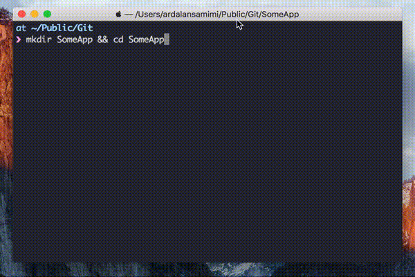

[](https://travis-ci.org/pkrll/Hazel)
[](https://codecov.io/gh/pkrll/Hazel)


``Hazel`` is a **cross-platform project scaffolding tool** that makes it easier to start new projects. The CLI application **generates the directory structure and boilerplate code** for your projects, based on **predefined templates**, and can **easily** be **customized and extended**.

- [x] Generate project structure based on templates
- [x] Support for macOS
- [ ] Confirmed support for Linux



## Table of contents

* [Installation](#installation)
	* [Prerequisites](#prerequisites)
	* [Homebrew](#install-with-homebrew)
	* [Make](#install-with-make)
* [Usage](#usage)
	* [Customization](#customization)
		* [Example](#example)
		* [Placeholders](#placeholders)
			* [Custom placeholders](#custom-placeholders)
	* [Command-line options](#command-line-options)
* [Tab completion](#tab-completion)
* [Acknowledgements](#acknowledgements)

## Installation

``Hazel`` has only been tested on macOS High Sierra (10.13).

#### Prerequisites

* Swift 4.0

#### Install with Homebrew

Tap into my personal repository of ``Homebrew`` formulas, and install using the ``--no-sandbox`` flag.

```bash
$ brew tap pkrll/tap
$ brew install hazel --no-sandbox
```

#### Install with Make

Clone this repository, and run ``make install``:

```bash
$ git clone https://github.com/pkrll/Hazel
$ cd Hazel
$ make install
```

This will install ``Hazel`` in ``/usr/local/bin``, along with its templates files in ``~/.hazel``.

## Usage

Run ``Hazel`` inside the root folder for your project with the ``init`` command, along with the ``--template``, or ``-t``, flag to generate the directory structure and the files:

```bash
$ mkdir SomeApp && cd SomeApp
$ hazel init --template c

Created obj
Created bin
Created tests
Created src
Created obj/.gitkeep
Created bin/.gitkeep
Created Makefile
Created tests/SomeApp_test.c
Created src/SomeApp.c
Created .editorconfig
```

### Customization

``Hazel`` generates new projects based on predefined templates, placed in ``~/.hazel/templates``. You can add your own templates by simply creating a desired directory structure, along with the files you want to be automatically generated, in a subdirectory to ``~/.hazel/templates``.

The name of the subdirectory will serve as the name of the template.

#### Example

Let's create a (**very**) simple template for Swift projects.

```bash
$ cd ~/.hazel/templates

$ mkdir Swift && cd Swift
$ touch README.md
$ mkdir src
$ touch src/__PROJECTNAME__.swift

# __PROJECTNAME__ is a placeholder that will be
# replaced by the project name when running hazel

$ tree
.
├── README.md
├── src
    └── __PROJECTNAME__.swift
```

To generate new projects based on the above template, we can now initiate a new project with template ``swift``:

```bash
$ mkdir AwesomeApp && cd AwesomeApp
$ hazel init --template swift

Created README.md
Created src
Created src/AwesomeApp.c
Created .editorconfig
```

#### Placeholders

When generating new projects, ``Hazel`` will replace all occurrences of certain placeholder variables in the template files with appropriate values. This includes both file and directory names as well as the actual contents of the template files.

As of now, built-in support exists for the placeholders shown below, but more can be added manually in the file ``~/.hazel/placeholders.json``.

| Placeholder | Description |
| :------------- | :------------- |
| ``__PROJECTNAME__`` | All occurrences of this placeholder will be replaced with the name of the project.       |
| ``__AUTHORNAME__`` | All occurrences of this placeholder will be replaced with the name of the author (default value set in ``placeholders.json`` will be overridden if flags ``-a "Name Nameson"`` or ``--author "Name Nameson"`` are present).       |
| ``__AUTHORMAIL__`` | All occurrences of this placeholder will be replaced with the name of the author (default value set in ``placeholders.json`` will be overridden if flag ``-e name@example.org`` or ``--email name@example.org`` are present).       |
| ``__DATE__`` | All occurrences of this placeholder will be replaced with the current date.       |

##### Custom placeholders

To add custom placeholders (or add default values for ``__AUTHORNAME__`` or ``__AUTHORMAIL__``), simply edit the file ``placeholders.json`` located in ``~/.hazel``:

```json
{
	"__AUTHORNAME__": "Dave Grohl",
	"__AUTHORMAIL__": "david@grohlson.com",
	"__LICENSE__": "MIT",
	"FOO": "BAR!"
}
```

### Commandline options

Currently, ``Hazel`` offers one command.

```bash
$ hazel --help
Usage: hazel [command] [argument]

Commands:
  init           Initiate a new project

Options:
  -h, --help     Print help message and exit
  -v, --version  Print version information and exit
  -q, --quiet    Silent mode


$ hazel init --help
Usage: hazel init [argument]

Options:
  -t, --template  Choose project template (required)
  -n, --name      Set the project name (leave empty to use the current directory name)
  -a, --author    Set author name
  -e, --email     Set e-mail
  --no-config     Do not generate .editorconfig
  -h, --help      Print help message and exit

```

## Tab completion

``Hazel`` comes equipped with tab completion for ``bash`` and ``zsh``. If you've installed it manually (not with Homebrew), then you need to add the following to your startup script (``.bashrc``, ``.zshrc``, etc...) to enable tab completion:

```bash
which hazel > /dev/null && . "$( hazel --completion-path )"
```

## Acknowledgements

``Hazel`` was created by [Ardalan Samimi](https://github.com/pkrll). This project is licensed under the terms of the MIT license. The hazel nut icon was designed by [Flaticon](https://www.flaticon.com).
